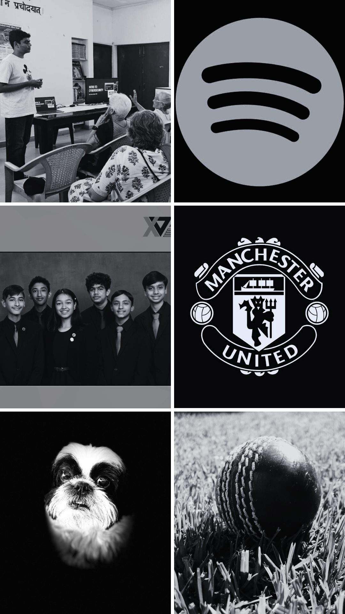

<head>
    <link rel="preconnect" href="https://fonts.googleapis.com">
    <link rel="preconnect" href="https://fonts.gstatic.com" crossorigin>
    <link href="https://fonts.googleapis.com/css2?family=Noto+Sans:ital,wght@0,100..900;1,100..900&display=swap" rel="stylesheet">
</head>

<body>
<!---->
    

        

        

<!---->
        

            
Ansh Kumar

        

    

<!---->
    

        

            

                

                    
Deep Learning.

                

                

                    
Network Engineering.

                

                

                    
Cybersecurity.

                

                

                    
Front-end Development.

                

            

            

                

                    
                

            

        

        

            
Hi, I'm Ansh. I'm a 10th grader at Del Norte High School. Above are the things that represent me; I'm big into volunteer work, as I hold classes for underprovileged IIT (and other engineering school) students and graduates in an effort to strengthen their interpersonal and communication skills for interviews and overall workplace conduct. I enjoy listening to music, hanging out with my friends, and playing with my dog, Magic. I plan on majoring in computer science (not sure which discipline), and thus far that's been a huge part of my acedemic career.

        

    

    <!---->
    
</body>

